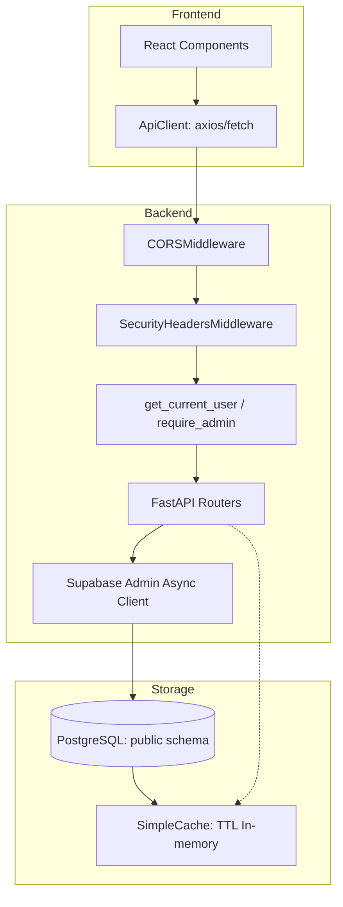
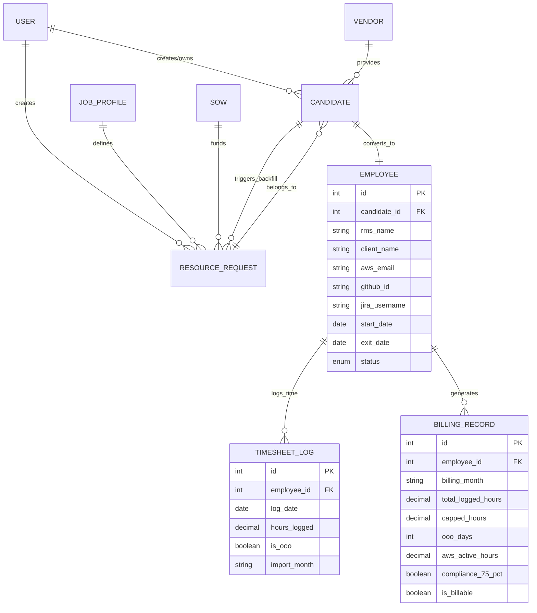

# RMS SPECIFICATION: SOURCE OF TRUTH

## 1. Topological Mapping: Data Flow


## 2. Entity-Relationship (ER) Spec


## 3. Context Anchors

| Feature | Critical Path Files (Backend) | Critical Path Files (Frontend) |
| :--- | :--- | :--- |
| **Global Middleware** | `backend/app/main.py` | `frontend/src/api/client.ts` |
| **Authentication** | `backend/app/auth/router.py`, `backend/app/auth/dependencies.py` | `frontend/src/context/AuthContext.tsx` |
| **Candidate Pipeline**| `backend/app/candidates/router.py`, `backend/app/candidates/schemas.py` | `frontend/src/pages/Candidates.tsx` |
| **Resource Requests** | `backend/app/resource_requests/router.py`, `backend/app/resource_requests/service.py` | `frontend/src/pages/ResourceRequests.tsx` |
| **SOW Management** | `backend/app/sows/router.py`, `backend/app/sows/schemas.py` | `frontend/src/pages/Sows.tsx` |
| **Employee Registry** | `backend/app/employees/router.py`, `backend/app/employees/schemas.py` | `frontend/src/pages/Employees.tsx` |
| **Timesheet Import** | `backend/app/timesheets/router.py`, `backend/app/timesheets/parser.py` | `frontend/src/pages/Timesheets.tsx` |
| **Billing Engine** | `backend/app/billing/router.py`, `backend/app/billing/engine.py` | `frontend/src/pages/Timesheets.tsx` |
| **Dashboard Analytics** | `backend/app/dashboard/router.py` | `frontend/src/pages/Dashboard.tsx` |
| **Cache Strategy** | `backend/app/utils/cache.py` | N/A (In-memory TTL 30s) |

## 4. Logic Decision Trees

### Candidate → Employee Transition Trigger
```python
# In candidates/router.py :: admin_review_candidate()
IF payload.status == ONBOARDED:
    IF NOT EXISTS employee WHERE candidate_id = candidate.id:
        INSERT employee(
            candidate_id, rms_name, client_name,
            jira_username, start_date, status='ACTIVE'
        )
```

### Billing Calculation Engine
```python
# In billing/engine.py :: calculate_billing()
FOR each employee WITH timesheets in month:
    1. Filter out entries AFTER exit_date (Exit Logic)
    2. Count OOO days (hours == 1.0)
    3. Apply 8h/day cap per entry
    4. Apply 40h/week cap per ISO week
    5. Check 75% Rule: aws_active >= 0.75 * capped_hours
    6. SET is_billable = NOT (exited OR compliance_fails)
```

### Timesheet Import (Idempotent Upsert)
```python
# In timesheets/router.py :: import_timesheet()
1. Parse XLS via pandas (xlrd/openpyxl engine)
2. Map jira_username → employee_id
3. DELETE existing entries for (employee_id, import_month)
4. INSERT fresh entries (batch of 100)
```

## 5. API Endpoints (New)

| Method | Path | Auth | Description |
| :--- | :--- | :--- | :--- |
| GET | `/employees/` | User | List employees (filterable by status) |
| POST | `/employees/` | Admin | Create employee manually |
| POST | `/employees/from-candidate/{id}` | Admin | Convert ONBOARDED candidate to employee |
| PATCH | `/employees/{id}` | Admin | Update employee triad mapping |
| PATCH | `/employees/{id}/exit` | Admin | Mark employee as exited |
| GET | `/timesheets/` | User | List timesheet entries |
| POST | `/timesheets/import` | Admin | Upload XLS and import timesheets |
| GET | `/billing/` | User | List billing records |
| POST | `/billing/calculate/{month}` | Admin | Calculate billing for a month |

## 6. Database Migrations

| Migration | File | Description |
| :--- | :--- | :--- |
| 002 | `002_add_missing_candidate_statuses.sql` | Add pipeline status enum values |
| 003 | `003_employees_and_timesheets.sql` | Create employees, timesheet_logs, billing_records tables |
