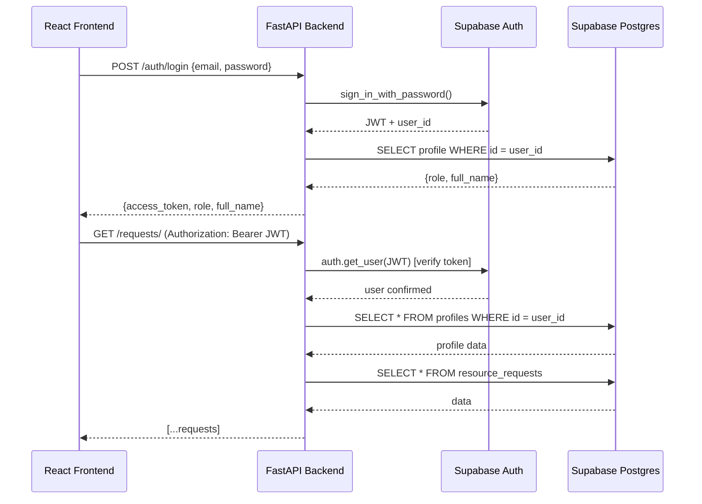

# Phase 1 Backend — Walkthrough

## What Was Built

A production-grade FastAPI backend for the RMS project, connected to Supabase (PostgreSQL), with **complete auth flow verified end-to-end**.

---

## Architecture Deep-Dive

```
backend/
├── app/
│   ├── main.py                    # FastAPI app, CORS, 7 routers
│   ├── config.py                  # pydantic-settings from .env
│   ├── database.py                # Supabase client factory (anon + service-role)
│   ├── auth/                      # Login, Me, JWT dependencies
│   │   ├── schemas.py             # LoginRequest, TokenResponse, UserProfile
│   │   ├── dependencies.py        # get_current_user (Supabase JWT), require_admin
│   │   └── router.py              # POST /auth/login, GET /auth/me
│   ├── job_profiles/              # CRUD with duplicate title check + delete guard
│   ├── resource_requests/         # Auto-ID (REQ-YYYYMMDD-XXX), status transitions
│   ├── candidates/                # 21-field form, multi-status pipeline
│   ├── sows/                      # SOW tracker with duplicate SOW number check
│   ├── communication_logs/        # Audit trail (request + candidate scoped)
│   └── dashboard/                 # Aggregated metrics by status/priority
├── tests/
│   ├── test_health.py             # ✅ PASS
│   └── test_request_id.py         # ✅ 3/3 PASS
├── scripts/
│   └── verify_auth.py             # E2E auth verification script
├── requirements.txt               # Pinned deps
├── pyproject.toml                 # pytest-asyncio auto mode
└── .env                           # Supabase credentials
```

### How Request Flow Works



### Key Design Decisions

| Decision | Rationale |
|----------|-----------|
| `supabase.auth.get_user(token)` over `python-jose` | Supabase uses ES256 (ECDSA) JWTs — `python-jose` only handles HS256 with the JWT secret |
| Service-role client for auth verification | `auth.get_user()` requires admin-level API key to validate tokens server-side |
| Anon key client for user-facing data queries | RLS enforced — users only see data they're authorized for |
| Auto-generated `REQ-YYYYMMDD-XXX` IDs | Per PRD Section 4.1 — human-readable display IDs for resource requests |
| Admin-only guards on write operations | Job profiles, SOWs require ADMIN role; requests/candidates open to all authenticated users |

---

## Auth Flow Test Results (All 6/6 ✅)

| Step | Test | Status | Verified |
|------|------|--------|----------|
| 1 | Login as Admin (`admin@siprahub.com`) | **200** | JWT returned, role=ADMIN, full_name=RMS Admin |
| 2 | GET /auth/me with JWT | **200** | Returns correct profile with email, role, full_name |
| 3 | GET /dashboard/metrics (protected) | **200** | Returns aggregated data (0 records — empty DB is correct) |
| 4 | GET /auth/me without token | **401** | "Not authenticated" |
| 5 | Login as Recruiter (`recruiter@siprahub.com`) | **200** | role=RECRUITER |
| 6 | POST /job-profiles/ as Recruiter | **403** | "Admin access required" — RBAC working |

### Test Users Seeded

| Email | Password | Role |
|-------|----------|------|
| `admin@siprahub.com` | `Admin123!` | ADMIN |
| `recruiter@siprahub.com` | `Recruiter123!` | RECRUITER |

---

## API Endpoints (14 total)

| Method | Path | Auth | Description |
|--------|------|------|-------------|
| GET | `/health` | — | Health check |
| POST | `/auth/login` | — | Supabase Auth login → JWT |
| GET | `/auth/me` | JWT | Current user profile |
| GET | `/job-profiles/` | JWT | List all job profiles |
| POST | `/job-profiles/` | Admin | Create job profile |
| GET | `/job-profiles/{id}` | JWT | Get single profile |
| PUT | `/job-profiles/{id}` | Admin | Update profile |
| DELETE | `/job-profiles/{id}` | Admin | Delete (guarded if linked to requests) |
| GET | `/requests/` | JWT | List requests (filterable by status/priority) |
| POST | `/requests/` | JWT | Create request (auto-ID REQ-YYYYMMDD-XXX) |
| GET | `/requests/{id}` | JWT | Get single request |
| PUT | `/requests/{id}` | JWT | Update request |
| PATCH | `/requests/{id}/status` | JWT | Transition status |
| GET | `/candidates/` | JWT | List candidates (filter by request/status) |
| POST | `/candidates/` | JWT | Submit candidate |
| GET | `/candidates/{id}` | JWT | Get single candidate |
| PATCH | `/candidates/{id}` | JWT | Update candidate |
| GET | `/sows/` | JWT | List SOWs |
| POST | `/sows/` | Admin | Create SOW |
| GET | `/sows/{id}` | JWT | Get single SOW |
| PATCH | `/sows/{id}` | Admin | Update SOW |
| GET | `/logs/` | JWT | List communication logs |
| POST | `/logs/` | JWT | Create log entry |
| GET | `/dashboard/metrics` | JWT | Aggregated request/candidate stats |

---

## Database Migrations Applied

1. **Initial schema** — 6 tables, 5 enums, RLS enabled
2. **Performance indexes** — 10 indexes on FK and filter columns
3. **Profile columns** — Added `email` and `avatar_url` to profiles

---

## Jira Progress Mapping

### Workstreams (5 total — all "To Do" in Jira)

| Jira Key | Workstream | Backend Status |
|----------|-----------|----------------|
| RMS-1 | Core Platform & Authentication | ✅ **Backend Done** — Auth endpoints + RBAC |
| RMS-2 | Resource Request Management | ✅ **Backend Done** — CRUD + status transitions |
| RMS-3 | Candidate Management | ✅ **Backend Done** — 21-field CRUD |
| RMS-4 | Admin Review & Onboarding | ⚠️ Partial — status transitions exist, UI needed |
| RMS-5 | Exits & SOW | ✅ **Backend Done** — SOW CRUD |

### Tasks (14 total — all "To Do" in Jira)

| Jira Key | Task | Backend API Ready? | Frontend Needed? |
|----------|------|-------------------|-----------------|
| RMS-6 | US-011 RBAC | ✅ Yes | ✅ Yes — role-based routing |
| RMS-7 | US-012 Login/Logout | ✅ Yes | ✅ Yes — login page |
| RMS-8 | US-001 Request Creation | ✅ Yes | ✅ Yes — form |
| RMS-9 | US-007 Dashboard Visibility | ✅ Yes | ✅ Yes — dashboard page |
| RMS-10 | US-002 Candidate Addition | ✅ Yes | ✅ Yes — 21-field form |
| RMS-11 | US-013 Resume Upload | ❌ No | ✅ Yes — Supabase Storage TBD |
| RMS-12 | US-003 Admin Profile Review | ⚠️ Partial | ✅ Yes — approve/reject UI |
| RMS-13 | US-004 Client Submission | ❌ No | ✅ Yes — email gen TBD |
| RMS-14 | US-005 Onboarding Workflow | ⚠️ Partial | ✅ Yes — billing start flow |
| RMS-15 | US-006 Exit Processing | ❌ No | ✅ Yes — new table TBD |
| RMS-16 | US-008 SOW Tracker | ✅ Yes | ✅ Yes — SOW page |
| RMS-17 | US-009 Backfill Automation | ❌ No | ✅ Yes — auto-create logic |
| RMS-18 | US-010 Communication Logging | ✅ Yes | ✅ Yes — log panel |
| RMS-19 | INFRA-001 Supabase Setup | ✅ Done | — |
| RMS-20 | INFRA-002 DB Schema | ✅ Done | — |
| RMS-21 | INFRA-003 FastAPI Scaffold | ✅ Done | — |
| RMS-22 | INFRA-004 React Frontend Setup | ❌ Not started | — |
| RMS-23 | INFRA-005 API Endpoint Definition | ✅ Done (14 endpoints) | — |
| RMS-24 | INFRA-006 CORS Configuration | ✅ Done | — |

### Summary: **~60% of backend is complete. 0% of frontend started.**

---

## What's Still Needed (Roadmap)

### Backend Remaining
1. **Resume Upload** (RMS-11) — Supabase Storage integration
2. **Exit Processing** (RMS-15) — `exits` table + exit workflow
3. **Backfill Automation** (RMS-17) — auto-create request on exit
4. **Client Submission** (RMS-13) — email draft generation
5. **Admin Review** (RMS-12) — approve/reject candidate workflow
6. **Onboarding** (RMS-14) — billing start date, Jira ticket creation

### Frontend (Not Started)
7. **INFRA-004** — React + Vite + TypeScript setup
8. Login page, Dashboard, Request form, Candidate form, SOW page, etc.

### Next Step
**Seed sample data** (job profiles, requests, candidates) so the dashboard returns real metrics, then start React frontend setup (INFRA-004).
